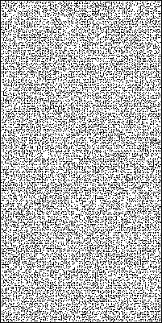
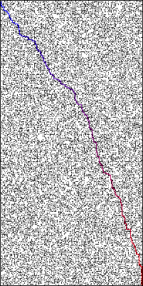
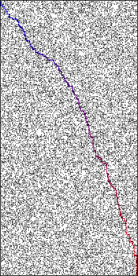

# Maze Solver
## By Anas Mazouni

To compare the diffrent implementations, I created a small python3 script that benchmarks the 3 methods by running them on randomly generated mazes and increasing the maze complexity (from 0 -> 50%) on each run.

The *avg = 10* variable refers to the number of benchmarks that are run on each solver, and the average elapsed time of these runs is then displayed in bar chart.

The script can also be run on multiple maze sizes by modifying the *sizes* variable.

To run the benchmarking script:
` cd build && make && python3 ../benchmark.py `

**P.S: I've disabled all imgshow() in the code so the process exits on solve**

As you can see, the results match the expected behavior: as we increase the complexity, the corridor solver becomes less efficient as there are less corridors to follow. The cell however is quite suited for the low wall density mazes.
## Generated maze and solutions

